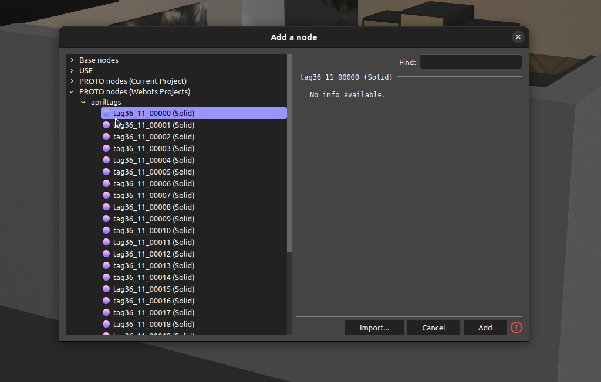
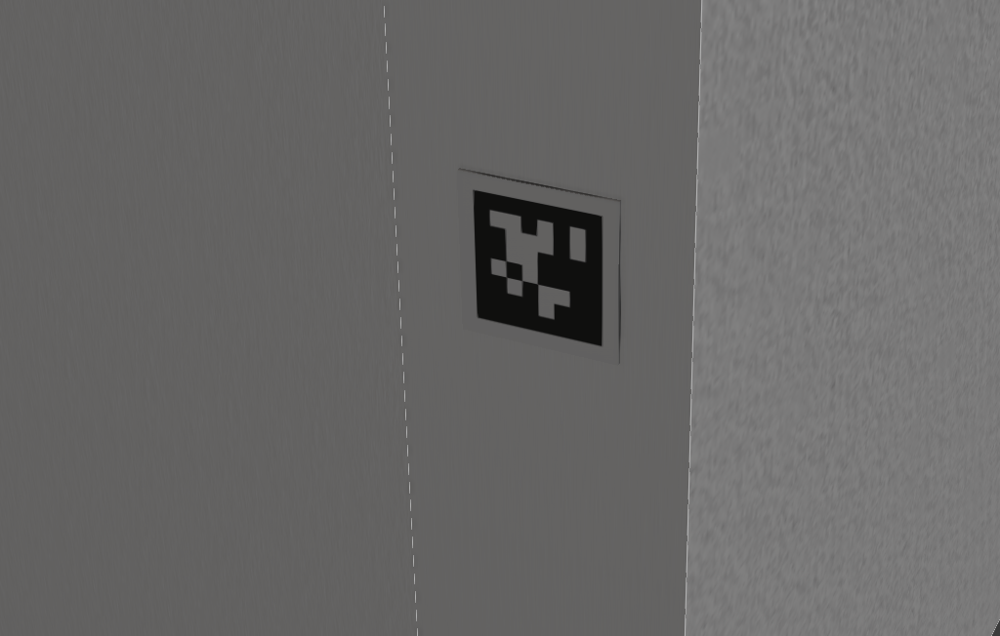

# webots_apriltag
(based on https://github.com/koide3/gazebo_apriltag)




```
git clone https://github.com/skpawar1305/webots_apriltag --recursive
cd webots_apriltag
```

Generate additional tag models:
```    
# Edit the following lines in generate.py to create tag models you want
    nr_of_tags = 20
    tags_directory = 'apriltag-imgs/tag36h11'
    tag_family = 'tag36_11_'
    tag_size = 2048
    webots_tag_size = 0.16
```
and run 
```
python3 generate.py
```

# Add models:
apriltags folder can be added in current project directory or webots directory

# To add in webots directory:
```
sudo cp -r apriltags /usr/local/webots/projects #if webots installed using apt 
```
If webots is installed through snap or ros, find it using
```
sudo find / -name webots
```

For different webots version probably changing #VRML_OBJ R2022a utf8 (first line) in AprilTag0.proto should do it
